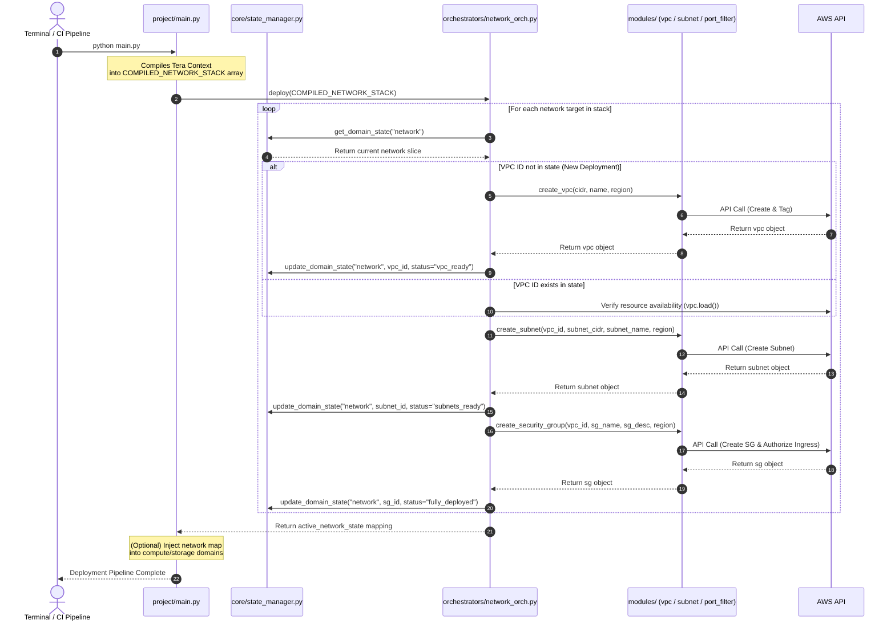

# Rescile Project

This repository provides a blueprint for an AWS Transit Hub using Rescile's UCS. The blueprint structures projects into common domain groups, like internet perimeter, cloud platform, cross-connect and private infrastructure. Domain groups decouple the state engine from the deployment code, collect the state from a cloud controller and integrate state signals from multiple providers. Python is used as a generic runtime to rely on provider SDK.

## Directory Structure

The project layout reflects common operational domain

```text
aws_network_hub/
├── project/
│   ├── main.py                  # Global Entry Point (Coordinates Group Orchestrators)
│   │
│   ├── core/
│   │   └── state_manager.py     # Pure State Engine (Agnostic of AWS logic)
│   │
│   ├── orchestrators/           # Tier 1: Domain Controllers
│   │   └── network_orch.py      # Sequences VPC -> Subnet -> Security Group
│   │
│   └── modules/                 # Tier 2: Atomic AWS Resource Builders
│       ├── vpc_builder.py
│       ├── subnet_builder.py
│       ├── port_filter.py
│       └── s3_builder.py

```

## Process Sequence

The directory structure enforces a layout where responsibilities are separated into predictable layers.



### 1. Entry Point

The `main.py` file represents the macro-level blueprint and handles top-level command-line flags, like `--delete`. It loads the state, calls `network_orch.deploy()`, grabs the resulting IDs, and feeds them into `compute_orch.deploy()` and coordinates the global reverse teardown (Compute $\rightarrow$ Storage $\rightarrow$ Network).

### 2. Domain Controllers 

Each domain file in the `orchestrators/` directory (e.g., `network_orch.py`) acts as the expert conductor for its specific silo. Domain controllers parse the domain-specific blocks from TOML templates and capture the tight intra-domain dependency sequencing (e.g., it calls `vpc_builder`, waits for the ID, then immediately feeds that ID into `subnet_builder` and `port_filter`). A controller returns a clean structured payload back to `main.py` and should remain provider independent.

### 3. Resource Modules

Modules remain small, generic, and hyper-focused python files. They are completely dumb to the overall business layout. A module like the `vpc_builder.py` just knows how to create or delete a VPC given a CIDR and a region. It doesn't know or care that a compute orchestrator is waiting down the line. Modules are usually defined cloud provider specific to reflect specific dependencies and requirements.

### 4. State Management

By isolating the state manager into a dedicated file in a `core/` folder, it becomes a utility that any layer can call. It reads/writes the `infra_state.json` matrix cleanly, tracking structural keys for each group (`state["network"]`, `state["storage"]`).
